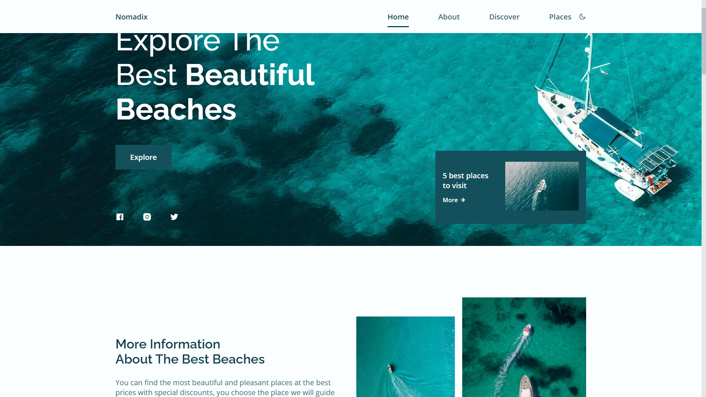

# Travel Agency Landing Page

A modern, responsive landing page for a travel agency, designed with a focus on UI/UX and smooth user interactions.

## 📸 Preview

## 🚀 Key Features
*   **Responsive Design:** Optimized for mobile, tablet, and desktop.
*   **Theme Switcher:** Seamless Dark/Light mode toggle.
*   **Interactive UI:** Powered by Swiper.js for destination discovery.
*   **Animations:** Smooth reveal effects using ScrollReveal.
*   **Modern Tech:** Built with clean, semantic HTML, CSS, and vanilla JS.

## 🛠️ Tech Stack
*   **Structure:** HTML5
*   **Styling:** CSS3 (Custom properties, Flexbox/Grid)
*   **Logic:** JavaScript (ES6+)
*   **Dependencies:** [Remixicon](https://remixicon.com/), [Swiper.js](https://swiperjs.com/), [ScrollReveal](https://scrollrevealjs.org/)

## 🔗 Links
*   **Live Demo:** [View Website](https://abdurahmonrahimov.uz/)
*   **Portfolio:** [abdurahmonrahimov.uz](https://abdurahmonrahimov.uz/)

---
*Created by Abdurahmon Rahimov*